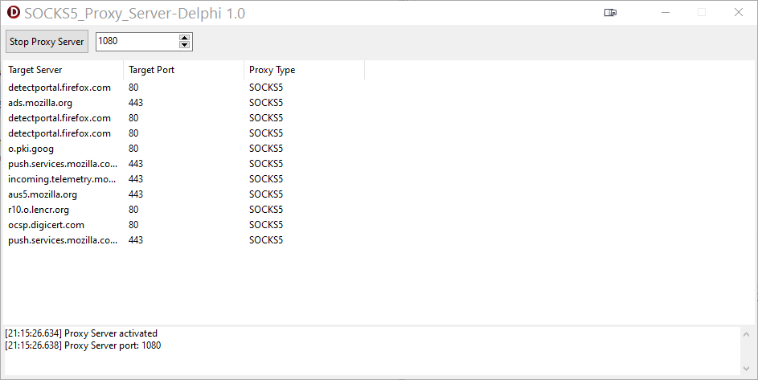

# SOCKS5 Proxy Server - Delphi Implementation

A lightweight and efficient SOCKS5 proxy server implementation in Delphi using the [Netcom7](https://github.com/DelphiBuilder/NetCom7) socket library. This implementation focuses on simplicity and reliability while maintaining good performance characteristics.

  

## Features

- **SOCKS5 Protocol Support**: Implements [RFC 1928](https://datatracker.ietf.org/doc/html/rfc1928) specification
- **Thread-Safe Design**: Proper synchronization for multi-threaded operation
- **Performance Optimized**: 
  - Uses non-blocking I/O
  - Configurable read buffer size (default: 8KB for proxy operations)
  - TCP optimization with NoDelay and KeepAlive options
- **Error Handling**: Comprehensive error detection and graceful connection termination
- **Connection Monitoring**: Built-in connection tracking and logging capabilities

## Technical Details

### Core Components

- `TProxyServer`: Main server class handling the SOCKS5 protocol implementation
- `TClientContext`: Context management for client connections
- `TncTCPServer`: Underlying TCP server from Netcom7 library
- `TncTCPClient`: Client implementation for target connections

### Supported SOCKS5 Features

- **Version**: SOCKS5 (version 5)
- **Authentication Methods**:
  - NO_AUTH (0x00)
- **Commands**:
  - CONNECT (0x01)
- **Address Types**:
  - IPv4 (0x01)
  - Domain Name (0x03)
- **Reply Codes**: 
   - Succeeded (0x00)
   - General SOCKS server failure (0x01)
   - Host unreachable (0x04)
   - Command not supported (0x07)
   - Address type not supported (0x08)

### Architecture

- **Event-Driven Design**: Uses callbacks for connection and data events
- **State Machine**: Clean state transitions (None → AuthMethod → Command → Forwarding)
- **Thread Pool**: Leverages Netcom7's thread pool for handling connections
- **Context Management**: Thread-safe context tracking with proper cleanup

## Limitations

1. **Authentication**:
   - Only supports NO_AUTH method
   - No username/password authentication
   - No GSSAPI support

2. **Command Support**:
   - Only CONNECT command implemented
   - No support for BIND command
   - No support for UDP ASSOCIATE

3. **Address Types**:
   - No IPv6 support
   - Limited to IPv4 and domain names

4. **Protocol Features**:
   - No support for SOCKS5 protocol extensions
   - No support for custom authentication methods

## Performance Considerations

- Default read buffer size: 8KB (configurable)
- TCP optimizations enabled by default:
  - TCP_NODELAY enabled
  - TCP KeepAlive supported
- Connection timeout: 5 seconds for target connections
- No automatic reconnection for target connections

## Requirements

- Delphi (Compatible with recent versions)
- Netcom7 socket library ⚠️
   - You must replace the original ncSockets.pas with the one provided in the Netcom7 folder.
   - I made changes in :
      - TncCustomTCPServer.DataSocketDisconnected
      - Created a new property to allow customizing 
the read buffer size

Optional: You can also replace the ncLines.pas (corrected version allowing compilation on Linux)

## Usage

For any application/browsers that supports SOCKS5 proxies, configure with :

- Proxy Type: SOCKS5
- Server: Your proxy server IP address
- Port: 1080 (default) or your configured port
- No authentication required

## Error Handling

The implementation includes comprehensive error handling for:
- Invalid protocol versions
- Unsupported commands
- Connection failures
- Network errors
- Resource cleanup

## Logging and Monitoring

- Connection tracking with unique connection IDs (based on socket handles)
- Error logging for connection failures and protocol violations
- Basic connection event logging (connect, disconnect)
- Visual connection monitoring through the UI

## ⚠️ Known bug

Sometimes web browsing no longer works. I still haven't found a solution.
OS-level socket connections work but nothing reaches the code.
If anyone would like to help find a solution it would really be appreciated 🙏

## Contributing

Contributions are welcome! If you have suggestions or bug fixes, please fork the repository and submit a pull request.

Made with ❤️ using Delphi RAD Studio

